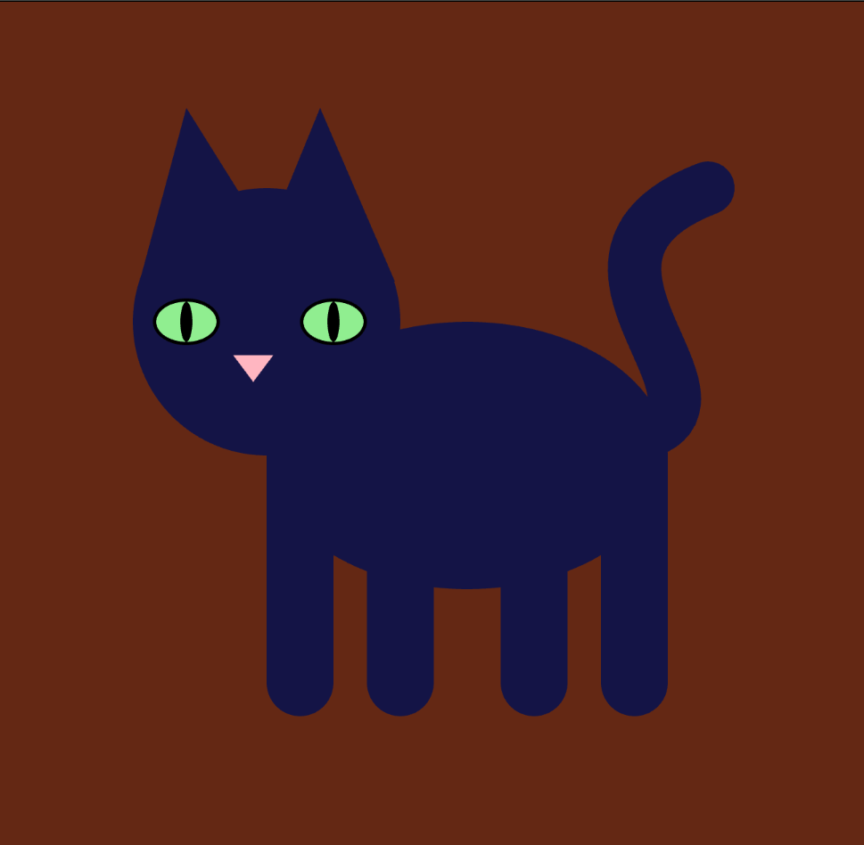
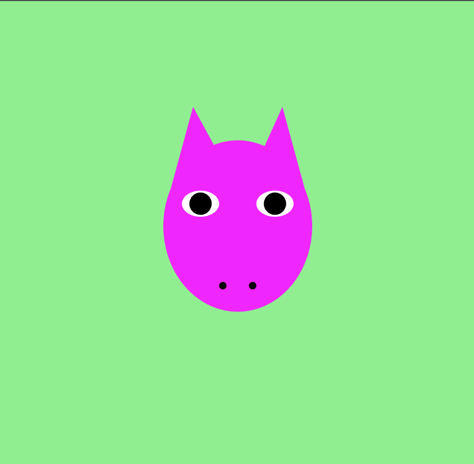
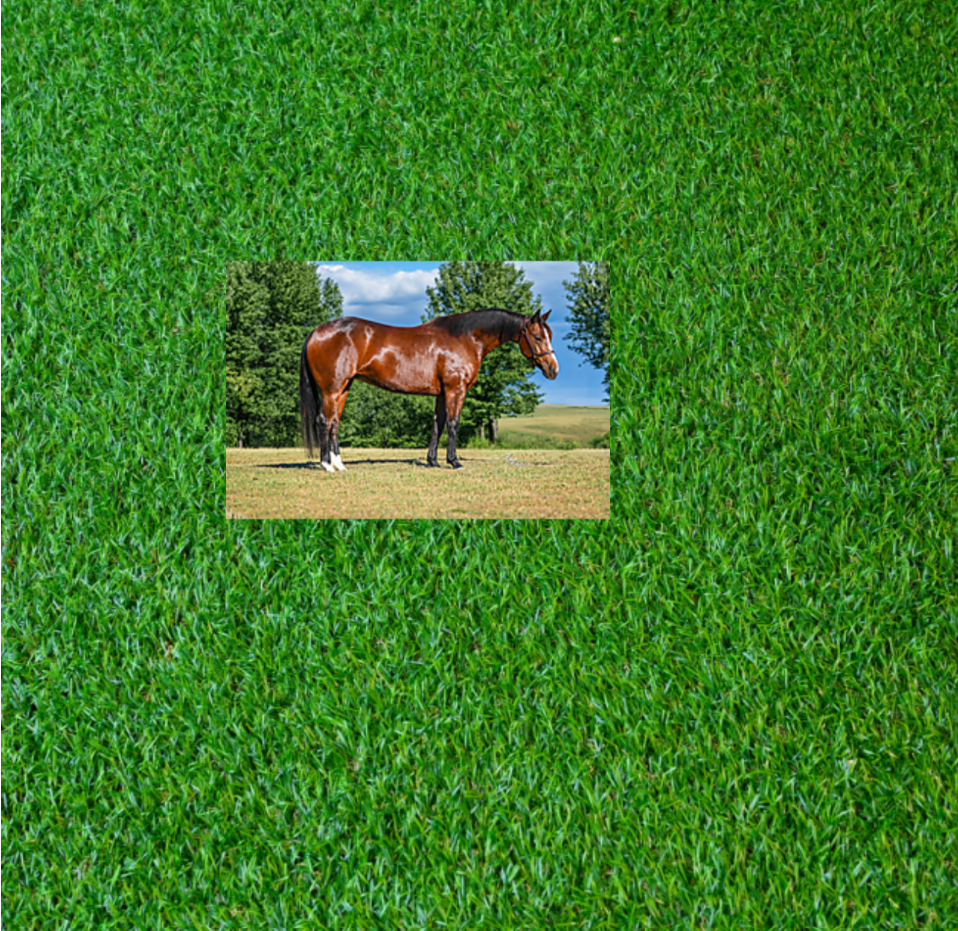

# cart253
Coursework repository for CART253 with Pippin Barr

> 

[Reflective Journal Entries](journal.md)

---

## Description

> This website is designed to organize my coursework throughout CART253. It will display my prototypes and it will document my learning process as I delve into GitHub for the first time. 

## Useful Links

> [Artstation](https://www.artstation.com/chorkel)

> [Instagram](https://www.instagram.com/chorkel.illu)

---

# Prototypes - Instructions

### Click Me Kitty

 > [View Online](./topics/prototyping/click-me-kitty/instructions-challenge/)

  > [View Code](https://github.com/chorkelle/cart253/tree/main/topics/prototyping/click-me-kitty/instructions-challenge)

### Don't Click Me Kitty

 > [View Online](./topics/prototyping/dont-click-me-kitty/instructions-challenge/)

  > [View Code](https://github.com/chorkelle/cart253/tree/main/topics/prototyping/dont-click-me-kitty/instructions-challenge)

### A Stroke of Genius

 > [A Stroke of Genius](./topics/prototyping/a-stroke-of-genius/a-stroke-of-genius/)

  > [View Code](https://github.com/chorkelle/cart253/tree/main/topics/prototyping/a-stroke-of-genius/a-stroke-of-genius)

## Journal Entry
 > [Instructions Journal](journal.md)

---

# Prototypes - Variables

### Rainbow Horse

 > [View Online](./topics/prototyping/abstract-horse/)

  > [View Code](https://github.com/chorkelle/cart253/tree/main/topics/prototyping/abstract-horse)

### Horsing Around

 > - [View Online](./topics/prototyping/prot3/)

  > -  [View Code](https://github.com/chorkelle/cart253/tree/main/topics/prototyping/prot3)

