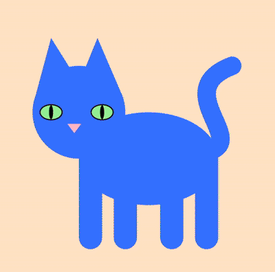

# Reflective Journal

## September 11, 2026

> Journal Entry 1. Full honesty, this has been one of the most frustrating experiences of my entire education career which is fair considering I've never really looked at code before. Making a website with no experience has been very confusing, especially since I do not necessarily understand what the final result is supposed to look like. That being said, I'm surprised by how fun I find the actual coding part of this. Pathing and learning the Markdown syntax is fun when I get to preview the results and see that things are working as intended. I find the most difficult part for me has been mostly navigating all these new platforms and ensuring my files are in the right place or named correctly or not corrupted, etc. I'm not familiar with computers in general so I find the filing and linking files and linking sites to be very confusing for me. I'm also a very visual learner so not having a video to follow along for this project has been difficult. I'm an illustrator so I am excited to dress this website up once I get the hang of actually making it, and I hope that people enjoy the way it will look. I am not sure what exactly I want the end result to look like just yet but I'm looking forward to learning the technical side of programming and seeing how my illustration background influences it.

> 

## September 20, 2026

> Journal Entry 2. I found that this week's work was much easier for me to do which makes sense considering I got to choose the parameters for each prototype. I actually had fun working on these projects which surprised me considering how frustrating making the website was for me. That being said, I spent a lot of time on them all individually and considering one of them refuses to do what I want it to do, I definitely need to reevaluate how much time I have to spend on these. As much as I have been enjoying this, I must admit that I'm still feeling a little uncertain as to if this program is really for me and my artistic practice. I'm hoping that as I learn more skills and am able to program more freely, I might figure out what exactly it is that I want to do. I really enjoyed the interactivity and I'm curious to see if theres a way to display illustrated assets instead of coded shapes. I think it would be cool to make my own assets and play around with the randomizer variables!

> 