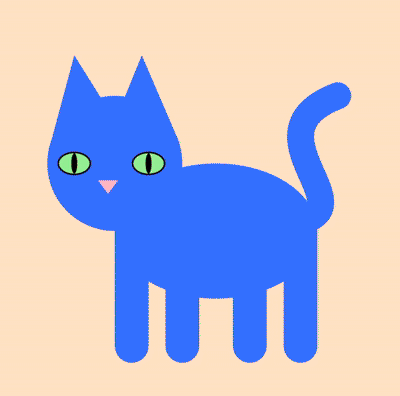
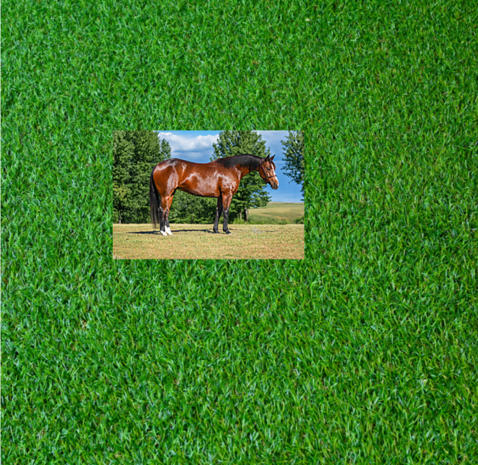
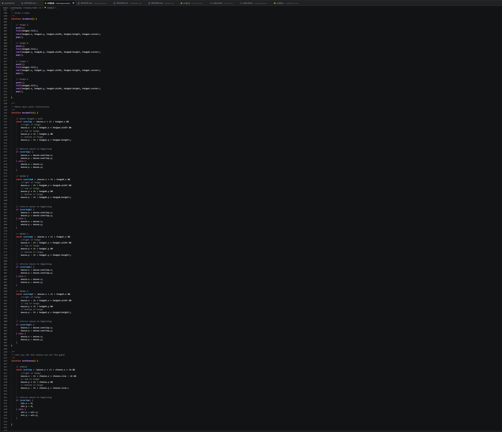

# Reflective Journal

## September 11, 2026

> Journal Entry 1. Full honesty, this has been one of the most frustrating experiences of my entire education career which is fair considering I've never really looked at code before. Making a website with no experience has been very confusing, especially since I do not necessarily understand what the final result is supposed to look like. That being said, I'm surprised by how fun I find the actual coding part of this. Pathing and learning the Markdown syntax is fun when I get to preview the results and see that things are working as intended. I find the most difficult part for me has been mostly navigating all these new platforms and ensuring my files are in the right place or named correctly or not corrupted, etc. I'm not familiar with computers in general so I find the filing and linking files and linking sites to be very confusing for me. I'm also a very visual learner so not having a video to follow along for this project has been difficult. I'm an illustrator so I am excited to dress this website up once I get the hang of actually making it, and I hope that people enjoy the way it will look. I am not sure what exactly I want the end result to look like just yet but I'm looking forward to learning the technical side of programming and seeing how my illustration background influences it.

> 

---

## September 20, 2026

> Journal Entry 2. I found that this week's work was much easier for me to do which makes sense considering I got to choose the parameters for each prototype. I actually had fun working on these projects which surprised me considering how frustrating making the website was for me. That being said, I spent a lot of time on them all individually and considering one of them refuses to do what I want it to do, I definitely need to reevaluate how much time I have to spend on these. As much as I have been enjoying this, I must admit that I'm still feeling a little uncertain as to if this program is really for me and my artistic practice. I'm hoping that as I learn more skills and am able to program more freely, I might figure out what exactly it is that I want to do. I really enjoyed the interactivity and I'm curious to see if theres a way to display illustrated assets instead of coded shapes. I think it would be cool to make my own assets and play around with the randomizer variables!

> 

---

## September 29, 2026

> Journal Entry 3. Despite minor issues and troubleshooting, this week's prototypes were fairly smooth to make and pretty fun to play around with. However, the image pathing issues that I ran into almost made me quit. As I'm writing this right now, I have fixed one of the paths but somehow disrupted two others. How? I have no clue, they are the same image so you would think the path would be the same... but no. Anyways. Besides that nightmare, I have found it fun to play with variables and interactivity with the mouse. I like the idea of working with drawn assets to make interative works of art or mini games (if i can ever figure out how the image pathing works). I'd like to mess around with functions for pressing keys so hopefully I get to do that next week.

> Hello from the other side (I actually fixed the pathing issues for the images). I'm glad I chose horses for this week's prototypes because they were silly enough to keep me from completely abandoning these projects when the image pathing took 4 hours. Thank god for discord and the f12 button. Now that I think I understand it better, I'm looking forward to experimenting with some illustrated assets soon!

---

## October 4, 2026

> Journal Entry 4. This week's prototypes were so much more complicated than last week's but I ended up happier with their outcomes and somehow it did not feel as tedious and difficult. Despite it being harder to code I found that the biggest issue I ran into was trying to figure out W A S D key controls but I did end up managing to code it in the end. I'm not 100% happy with the results, its not the smoothest movement ever, but it was very rewarding to figure out in the moment! Umbrella Sim and Mousey Maze were very fun to play around with and I enjoyed troubleshooting all of the overlap functions along the way. I had way more fun making the programs interative like this than I have in the past so I think I'd like to move forward with these kinds of minigame-adjacent codes. Like I had mentioned in a previous journal entry, I would like to mess around with adding externally drawn elements hopefully soon, and after dealing with circle x circle, rectangle x rectangle, circle x rectangle interaction I feel closer to be at that level. I have not messed around with rotation of objects (or images...) yet, but I think that's something that would be beneficial to learn next.

